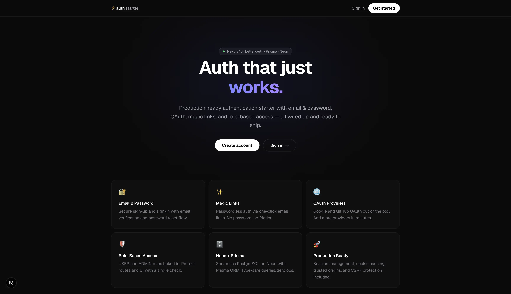
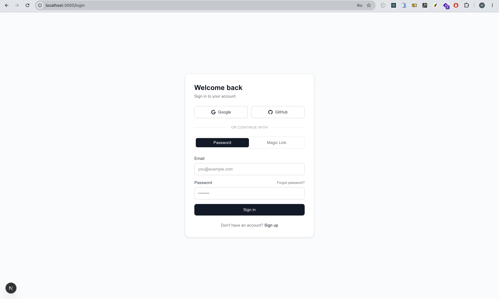
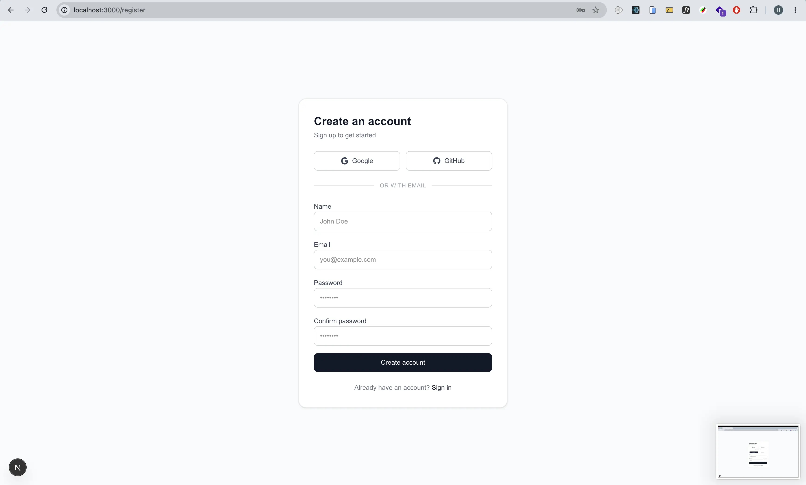
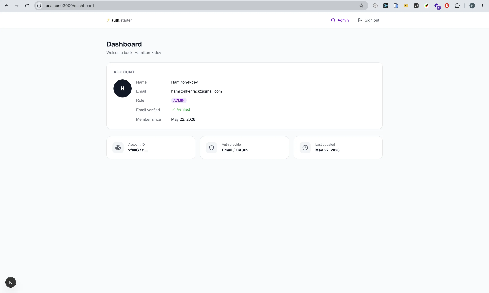
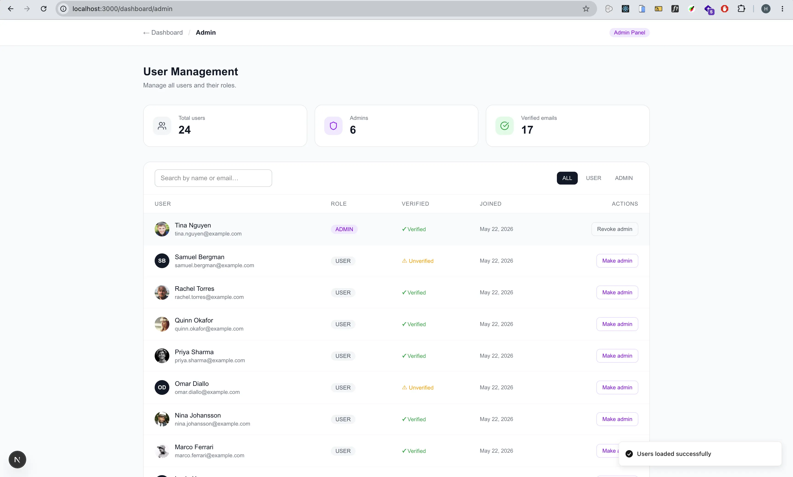

# ⚡ Next.js Better Auth Starter



A production-ready authentication starter built with the latest versions of Next.js, better-auth, Prisma, and Neon. Everything you need to ship auth fast — email/password, OAuth, magic links, role-based access, and transactional emails all wired up out of the box.

🔗 **[View Demo](https://nextjs-better-auth-stater.vercel.app)**

---

## ✨ Features

- 🔐 **Email & Password** — sign up, sign in, email verification, password reset
- ✨ **Magic Links** — passwordless authentication via email
- 🌐 **OAuth** — Google and GitHub providers
- 🛡️ **Role-Based Access Control** — `USER` and `ADMIN` roles with protected routes
- 📧 **Transactional Emails** — powered by Resend
- 🗄️ **Neon + Prisma** — serverless PostgreSQL with type-safe ORM
- 🚀 **Session Management** — cookie caching, trusted origins, CSRF protection
- 🎨 **Pure Tailwind CSS** — no component library dependency

---

## 🧱 Stack

| Layer          | Technology                   |
| -------------- | ---------------------------- |
| Framework      | Next.js 16 (App Router)      |
| Authentication | better-auth                  |
| Database       | Neon (serverless PostgreSQL) |
| ORM            | Prisma 7                     |
| Validation     | Zod                          |
| Forms          | React Hook Form              |
| Emails         | Resend                       |
| Styling        | Tailwind CSS                 |
| Icons          | Lucide React                 |

---

## 🖼️ Pages

### Landing

The public entry point — introduces the app and links to sign in / sign up.


### Login

Sign in with email + password, a magic link, or OAuth (Google / GitHub). Includes a forgot password link.



### Register

Create a new account with email + password or OAuth. Sends a verification email on sign up.



### Dashboard

Protected user dashboard showing account details, role badge, and email verification status.



### Admin Panel

Accessible to `ADMIN` users only. Lists all users with search, role filter, and promote / revoke controls.



---

## 📁 Project Structure

```
src/
├── app/
│   ├── page.tsx                        # Landing page
│   ├── (auth)/
│   │   ├── login/page.tsx              # Login (password + magic link + OAuth)
│   │   ├── register/page.tsx           # Registration
│   │   └── reset-password/page.tsx     # Forgot & reset password
│   ├── (protected)/
│   │   └── dashboard/
│   │       ├── page.tsx                # User dashboard
│   │       └── admin/page.tsx          # Admin panel (ADMIN role only)
│   └── api/
│       ├── auth/[...all]/route.ts      # better-auth handler
│       └── admin/users/route.ts        # Admin user management API
├── lib/
│   ├── auth.ts                         # better-auth server config
│   ├── auth-client.ts                  # better-auth browser client
│   ├── db.ts                           # Prisma singleton
│   └── validations/
│       └── auth.ts                     # Zod schemas
└── proxy.ts                            # Route protection + RBAC (Next.js 16)
```

---

## 🚀 Getting Started

### 1. Clone the repo

```bash
git clone https://github.com/hamilton-k-dev/nextjs-better-auth-stater
cd nextjs-better-auth-starter
```

### 2. Install dependencies

```bash
npm install
```

### 3. Set up environment variables

Copy the example env file and fill in your values:

```bash
cp .env.example .env
```

```env
# App
NEXT_PUBLIC_APP_URL="http://localhost:3000"
BETTER_AUTH_URL="http://localhost:3000"
BETTER_AUTH_SECRET=""              # openssl rand -base64 32

# Database (Neon)
DATABASE_URL=""                    # pooled connection URL
DIRECT_URL=""                      # direct connection URL (remove -pooler from host)

# Email (Resend)
RESEND_API_KEY=""                  # from resend.com
EMAIL_FROM="onboarding@resend.dev" # use your domain in production

# Google OAuth
GOOGLE_CLIENT_ID=""
GOOGLE_CLIENT_SECRET=""

# GitHub OAuth
GITHUB_CLIENT_ID=""
GITHUB_CLIENT_SECRET=""
```

### 4. Set up the database

```bash
npx prisma migrate dev --name init
npx prisma generate
```

### 5. Run the development server

```bash
npm run dev
```

Visit [http://localhost:3000](http://localhost:3000)

---

## 🔑 OAuth Setup

### Google

1. Go to [console.cloud.google.com](https://console.cloud.google.com)
2. Create a project → APIs & Services → Credentials
3. Create OAuth 2.0 Client ID (Web application)
4. Add authorized redirect URI:
   ```
   http://localhost:3000/api/auth/callback/google
   ```

### GitHub

1. Go to GitHub → Settings → Developer settings → OAuth Apps → New OAuth App
2. Set authorization callback URL:
   ```
   http://localhost:3000/api/auth/callback/github
   ```

---

## 📧 Email Setup (Resend)

1. Sign up at [resend.com](https://resend.com) — free tier includes 3,000 emails/month
2. Create an API key → add to `.env` as `RESEND_API_KEY`
3. For testing, use `EMAIL_FROM=onboarding@resend.dev` (can only send to your own email)
4. For production, verify your domain at [resend.com/domains](https://resend.com/domains) and use `no-reply@yourdomain.com`

---

## 🛡️ Role-Based Access Control

Users have a `role` field with two values: `USER` (default) and `ADMIN`.

Protect a server page:

```ts
import { requireAuth } from "@/lib/actions/auth";

export default async function Page() {
  const session = await requireAuth(); // redirects to /login if not authenticated
  return <div>Hello {session.user.name}</div>;
}
```

Protect an admin page:

```ts
import { requireAdmin } from "@/lib/actions/auth";

export default async function AdminPage() {
  const session = await requireAdmin(); // redirects to /dashboard if not admin
  return <div>Admin only</div>;
}
```

Promote a user to admin via Prisma Studio:

```bash
npx prisma studio
```

---

## 🗺️ Routes

| Route              | Access     | Description                           |
| ------------------ | ---------- | ------------------------------------- |
| `/`                | Public     | Landing page                          |
| `/login`           | Public     | Sign in (password, magic link, OAuth) |
| `/register`        | Public     | Create account                        |
| `/reset-password`  | Public     | Forgot & reset password               |
| `/dashboard`       | Protected  | User dashboard                        |
| `/dashboard/admin` | Admin only | Admin panel                           |

---

## 📦 Key Scripts

```bash
npm run dev          # Start development server
npm run build        # Build for production
npm run start        # Start production server
npx prisma studio    # Open Prisma database UI
npx prisma migrate dev --name <name>  # Create a new migration
npx prisma generate  # Regenerate Prisma client
```

---

## 🚢 Production Checklist

- [ ] Set `BETTER_AUTH_URL` to your production domain
- [ ] Set `NEXT_PUBLIC_APP_URL` to your production domain
- [ ] Update OAuth redirect URIs in Google and GitHub consoles
- [ ] Generate a strong `BETTER_AUTH_SECRET` (`openssl rand -base64 32`)
- [ ] Verify your sending domain in Resend and update `EMAIL_FROM`
- [ ] Use Neon's pooled connection URL for `DATABASE_URL`

---

## 📄 License

MIT
